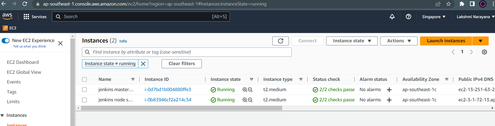
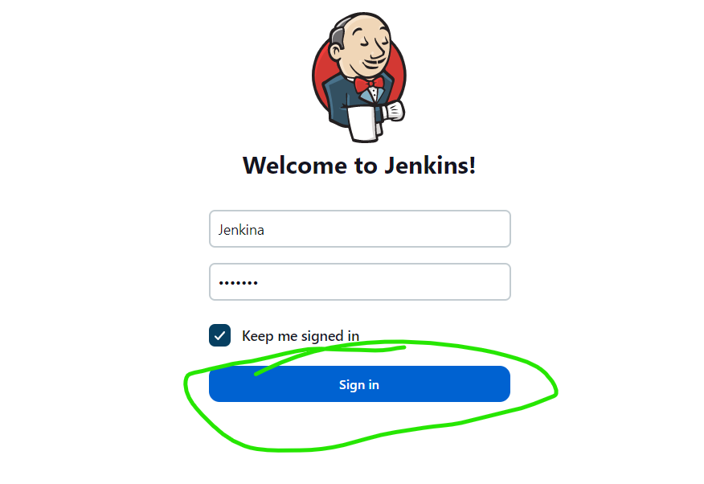
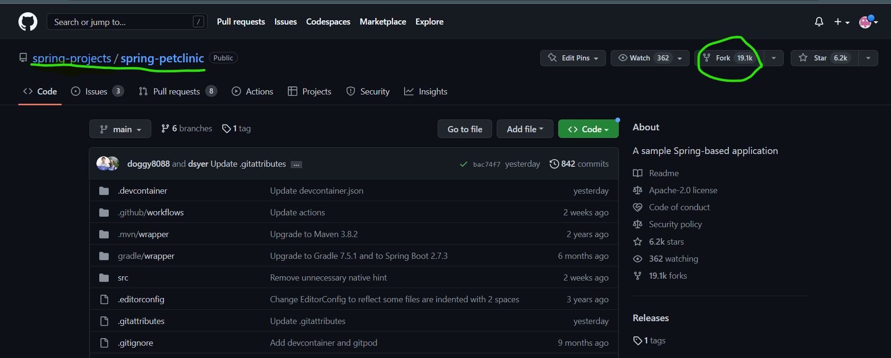
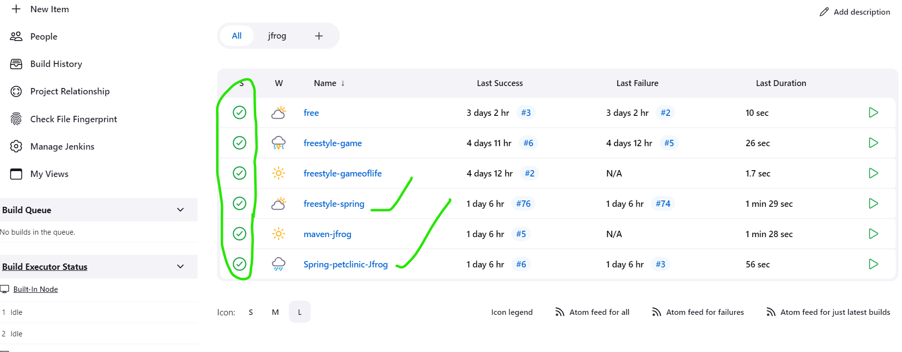
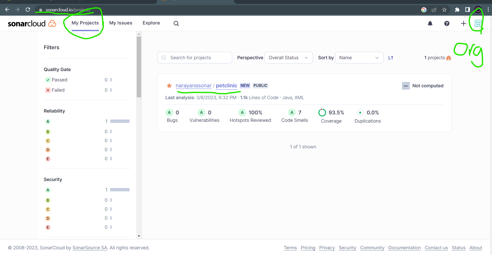
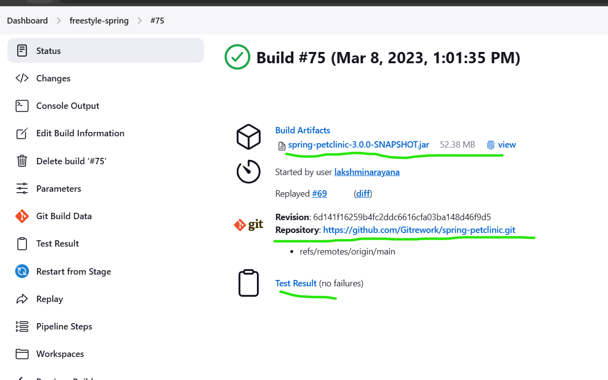
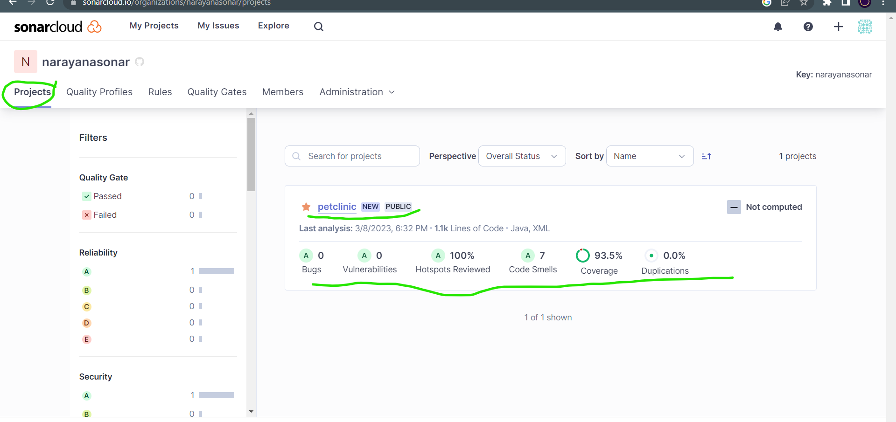

## In Jenkins Pipeline configure with Sonar-Cloud analysis
----------------------------------------------------------
* Take 2 ec2 instances `t2.large`
   * Master - `install openjdk-17-jdk, jenkins, maven`
   * Node - `install openjdk-8-11-17-jdk, maven`
* 
* To take public `<ip-address:8080>` in search bar and connect Jenkins dashboard.

* In these above ec2 node instance take to create one new node in `credentials`
  in these node creating purpose we take only .pemkey is used with `sshkey and passwd`.
* Create one `declarative-pipeline` and give the credentials.
* Go to ==>`manage jenkins-- global tool` and   given jdk installation paths `17,11,8` 
  ex:->`/usr/lib/jvm/java-openjdk-17-amd64` 
* Next take a new a new repository in github account and fork the Spring-petclinic content into our repository.

* Next goto git-bash terminal clone the code in to one folder and then go to
  vs code use `code .` 
* Then create a new file `Jenkinsfile` and write the code for to build maven package.
```yaml
pipeline {
    agent { label 'SPRING-PET' }
    stages {
        stage('vcs') {
            steps {
                git url: 'https://github.com/GitpracticeDemo/spring-petclinic.git',
                    branch: 'declarative'
            }
        }
        stage('package') {
            steps {
                sh 'mvn package'
            }
        }
        stage('post build') {
            steps {
                archiveArtifacts artifacts: '**/target/spring-petclinic-3.0.0-SNAPSHOT.jar',
                   allowEmptyArchive: true,
                   fingerprint: true,
                   onlyIfSuccessful: true
                junit testResults: '**/surefire-reports/TEST-*.xml'
            }
        }
    }
}
```
Its successfully build.

* Create an account in SonarCloud and then create an Organisation [Refer Here](https://sonarcloud.io/projects) my sonar cloud cloud.

* Use these sonarcloud url And secret token on Notepad++
* Go to credentials create a new token for Sonar-purpose
* And go to Manage plugins install `Sonar QubeScanner` and give credentials of Sonarpurpose.
   * And next we add sonar analysis steps in above pipeline 
```yaml
        stage('sonar analysis') {
            steps {
                  withSonarQubeEnv('SONAR_CLOUD') {
                    sh 'mvn verify org.sonarsource.scanner.maven:sonar-maven-plugin:sonar -Dsonar.projectKey=narayanasonar_sonarproject -Dsonar.organization=narayanasonar'
                }
            }
        }
```

* And these results are also see in SonarCloud also 

* In these we are also add mail configuration also then the build was sussess we get mail and then fail also we get mail.
 