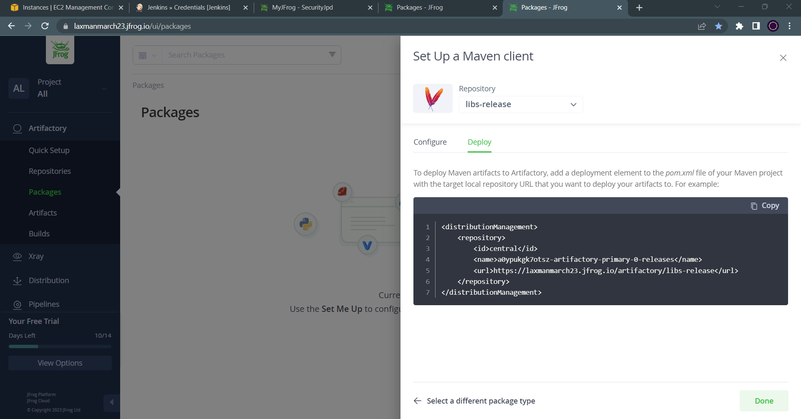
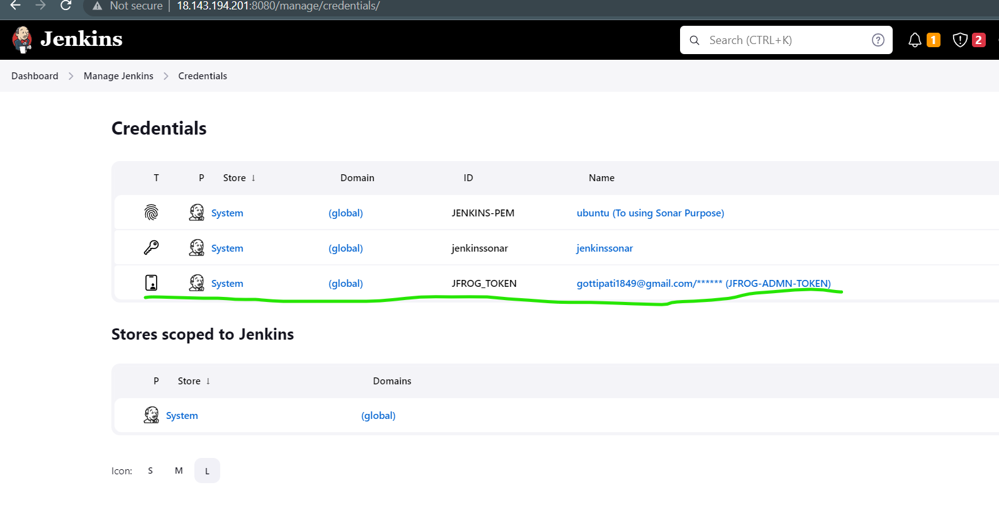
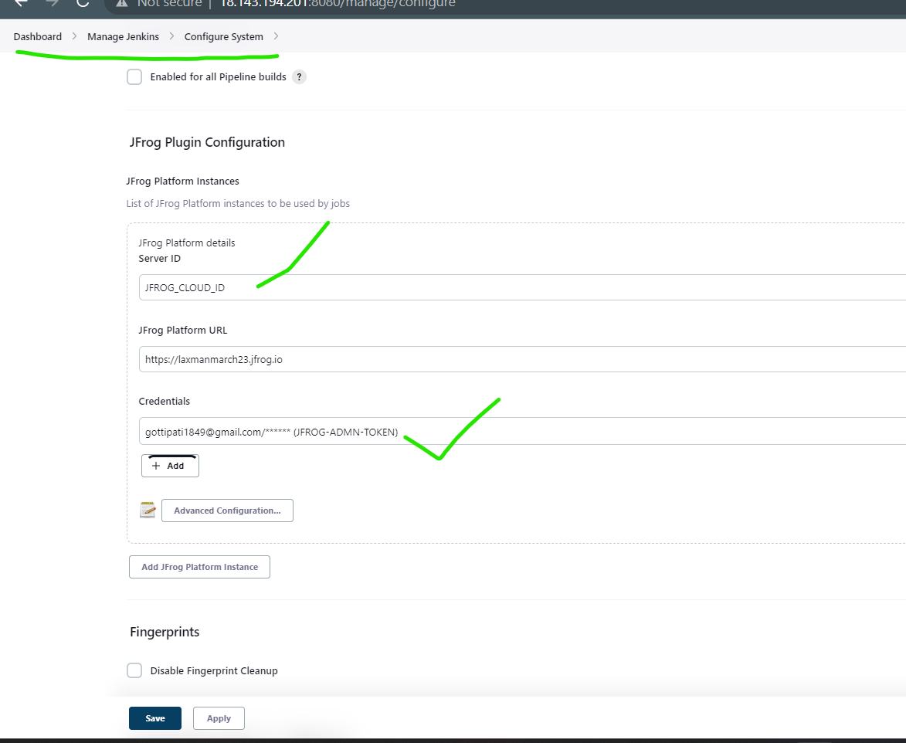
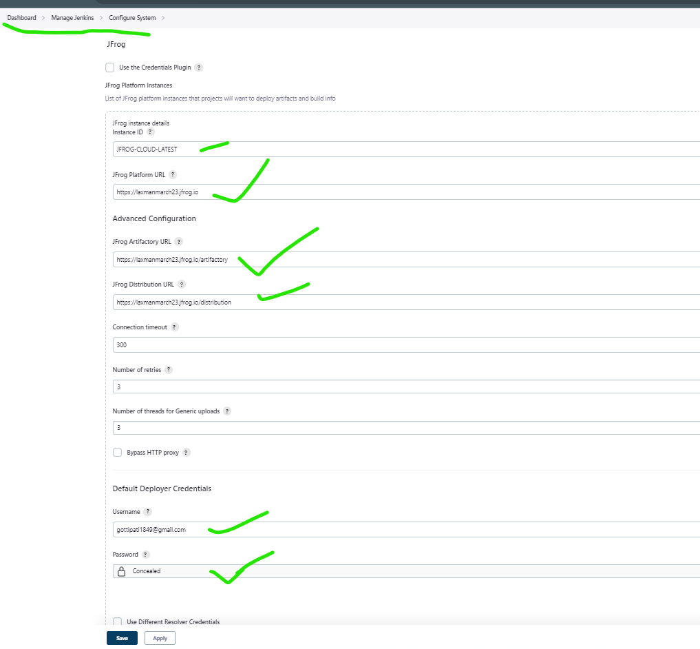
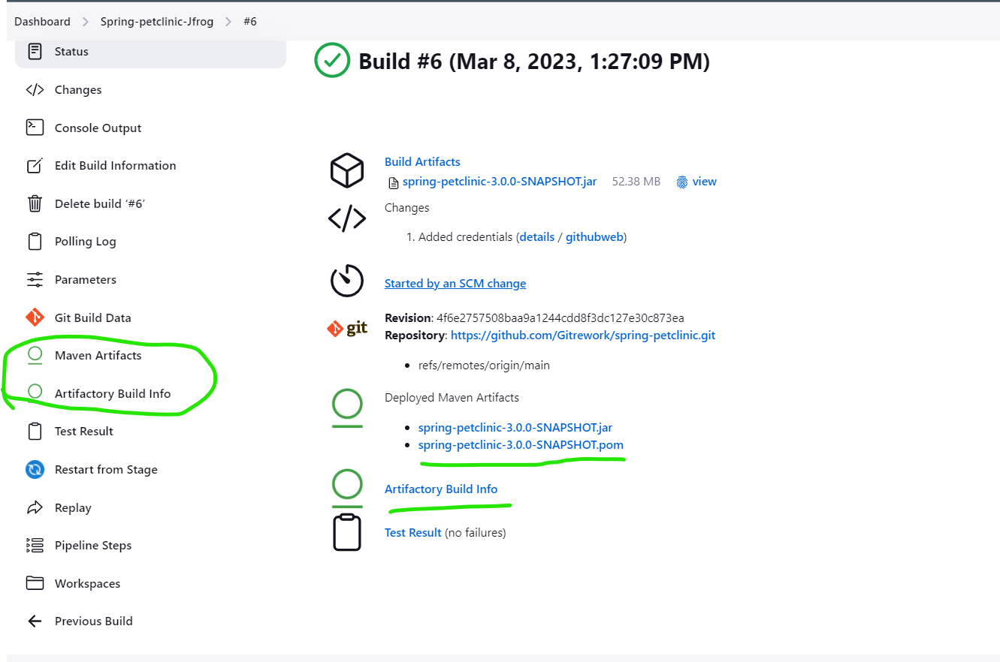
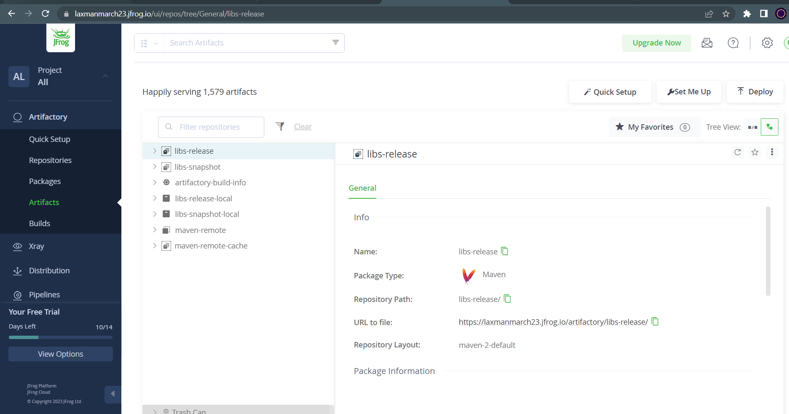
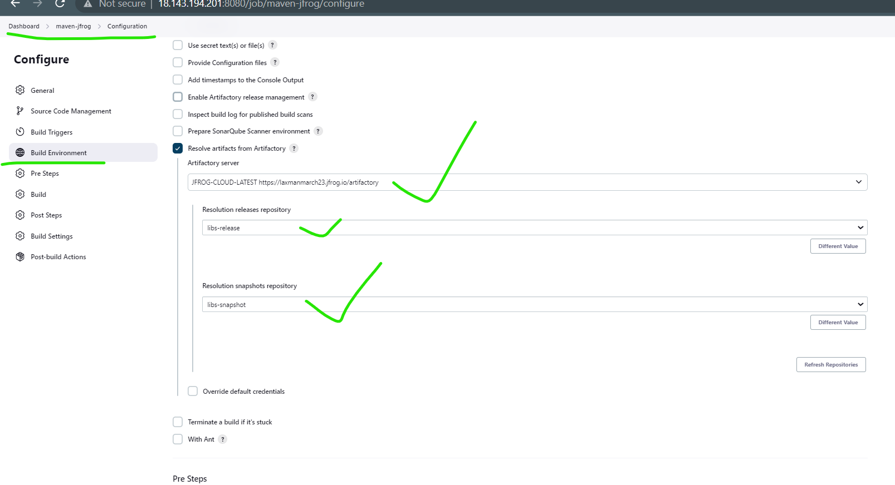
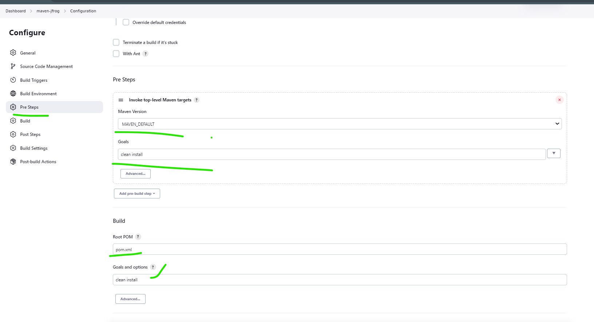
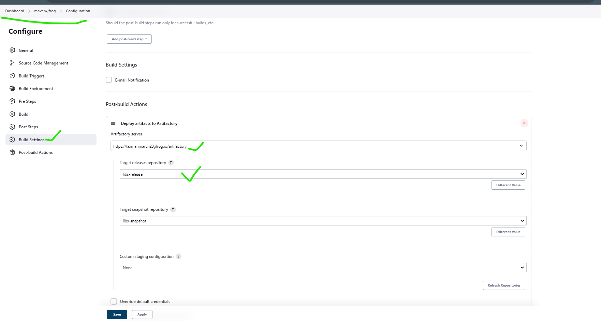
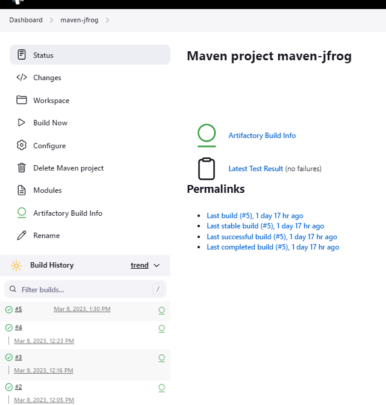

 ### In Jenkins pipeline we use JFROG module
--------------------------------------------
* In this project we also use `SpringPetcllinic`.
* Firstly these content `fork` into our repository. 
* Open VS-code and create one `Jenkinsfile`
   * In these we adding `Stages, Triggers, parametrers`
* Next login into our JENKINS masternode Take a new pipeline.
* Go to Managejenkins > manage plugins > install `JFROG inventory` and `Arifactory`.
* Create a new account in JFROG 14-days free style and login into these account.
```
<?xml version="1.0" encoding="UTF-8"?>
<settings xsi:schemaLocation="http://maven.apache.org/SETTINGS/1.2.0 http://maven.apache.org/xsd/settings-1.2.0.xsd" xmlns="http://maven.apache.org/SETTINGS/1.2.0"
    xmlns:xsi="http://www.w3.org/2001/XMLSchema-instance">
  <servers>
    <server>
      <username>gottipati1849@gmail.com</username>
      <password>cmVmdGtuOjAxOjE3MDk2NjQyMzI6UDJ3VGlLaDBMclV6ZTdHbld0ZnN4cVhOMWFu</password>
      <id>central</id>
    </server>
    <server>
      <username>gottipati1849@gmail.com</username>
      <password>cmVmdGtuOjAxOjE3MDk2NjQyMzI6UDJ3VGlLaDBMclV6ZTdHbld0ZnN4cVhOMWFu</password>
      <id>snapshots</id>
    </server>
  </servers>
  <profiles>
    <profile>
      <repositories>
        <repository>
          <snapshots>
            <enabled>false</enabled>
          </snapshots>
          <id>central</id>
          <name>libs-release</name>
          <url>https://laxmanmarch23.jfrog.io/artifactory/libs-release</url>
        </repository>
        <repository>
          <snapshots />
          <id>snapshots</id>
          <name>libs-snapshot</name>
          <url>https://laxmanmarch23.jfrog.io/artifactory/libs-snapshot</url>
        </repository>
      </repositories>
      <pluginRepositories>
        <pluginRepository>
          <snapshots>
            <enabled>false</enabled>
          </snapshots>
          <id>central</id>
          <name>libs-release</name>
          <url>https://laxmanmarch23.jfrog.io/artifactory/libs-release</url>
        </pluginRepository>
        <pluginRepository>
          <snapshots />
          <id>snapshots</id>
          <name>libs-snapshot</name>
          <url>https://laxmanmarch23.jfrog.io/artifactory/libs-snapshot</url>
        </pluginRepository>
      </pluginRepositories>
      <id>artifactory</id>
    </profile>
  </profiles>
  <activeProfiles>
    <activeProfile>artifactory</activeProfile>
  </activeProfiles>
</settings>
```

* In these we create a maven project and some credentials are shown. These credentials are copy  and paste it on notepad ++.

* Navigate to Credentials and create one username with key used to Jfrog credentials(notepad ++) 
* Navigate to configure system in added `Jfrog platform`  urls, usernames, passwd, Jrog artifactory's.


* Go to pipelines and write pipelines 
```yaml
pipeline {
    agent { label 'SONAR-NODE' }
    triggers { pollSCM ('* * * * *') }
    parameters {
        choice(name: 'MAVEN_GOAL', choices: ['package', 'install', 'clean'], description: 'Maven Goal')
    }
    stages {
        stage('vcs') {
            steps {
                git url: 'https://github.com/Gitrework/spring-petclinic.git',
                    branch: 'main'
            }
        }
        stage ('Artifactory configuration') {
            steps {
                rtServer (
                    id: "ARTIFACTORY_SERVER",
                    url: 'https://laxmanmarch23.jfrog.io/artifactory',
                    credentialsId: 'JFROG_TOKEN'
                )

                rtMavenDeployer (
                    id: "MAVEN_DEPLOYER",
                    serverId: "ARTIFACTORY_SERVER",
                    releaseRepo: 'libs-release',
                    snapshotRepo: 'libs-snapshot'
                )

                rtMavenResolver (
                    id: "MAVEN_RESOLVER",
                    serverId: "ARTIFACTORY_SERVER",
                    releaseRepo: 'libs-release',
                    snapshotRepo: 'libs-snapshot'
                )
            }
        }
        stage('package') {
            tools {
                jdk 'JAVA-17-JDK'
            }
            steps {
                rtMavenRun (
                    tool: 'MAVEN_DEFAULT',
                    pom: 'pom.xml',
                    goals: 'clean install',
                    deployerId: "MAVEN_DEPLOYER"
                    
                )
                rtPublishBuildInfo (
                    serverId: "ARTIFACTORY_SERVER"
                )
                //sh "mvn ${params.MAVEN_GOAL}"
            }
        }
        stage('post build') {
            steps {
                archiveArtifacts artifacts: '**/target/spring-petclinic-3.0.0-SNAPSHOT.jar',
                                 onlyIfSuccessful: true
                junit testResults: '**/surefire-reports/TEST-*.xml'
            }
        }
    }
}
```
* Then build Success we see the Artifactory results in Jfog cloud


* We select `MAVEN PROJECT` 
* Above steps are added and  Navigate to global tool configuration below steps are added.
 


* And Start the pipeines to start then Successfully build we see the artifactorys in cloud also

* These results are also see in Jfrog cloud.
* Then we can also add mail configuration use `mailtrap` credentials
* Use these mail config then build Success we got the mail build Succeed are not.
